# Figures

*Fourteen figures supporting the chapters of this volume. Mermaid diagrams render natively on GitHub for immediate visual assessment; TikZ source is included for book-build typesetting.*

*Figure convention: Fig X.Y means "figure Y in chapter X." Appendix figures are Fig A.Y, Fig B.Y.*

---

## Fig 1.0.1 — 𝒞_Str as a DAG of streams

**Illustrates.** The category of streams as a directed acyclic graph under cooperative-constituency. Each node is a stream (σ, K, Ω, γ); each arrow is a lift ι. Restrictions κ are the adjoint arrows (not shown, for readability).

**Chapter.** §1.0 (Category of Streams).

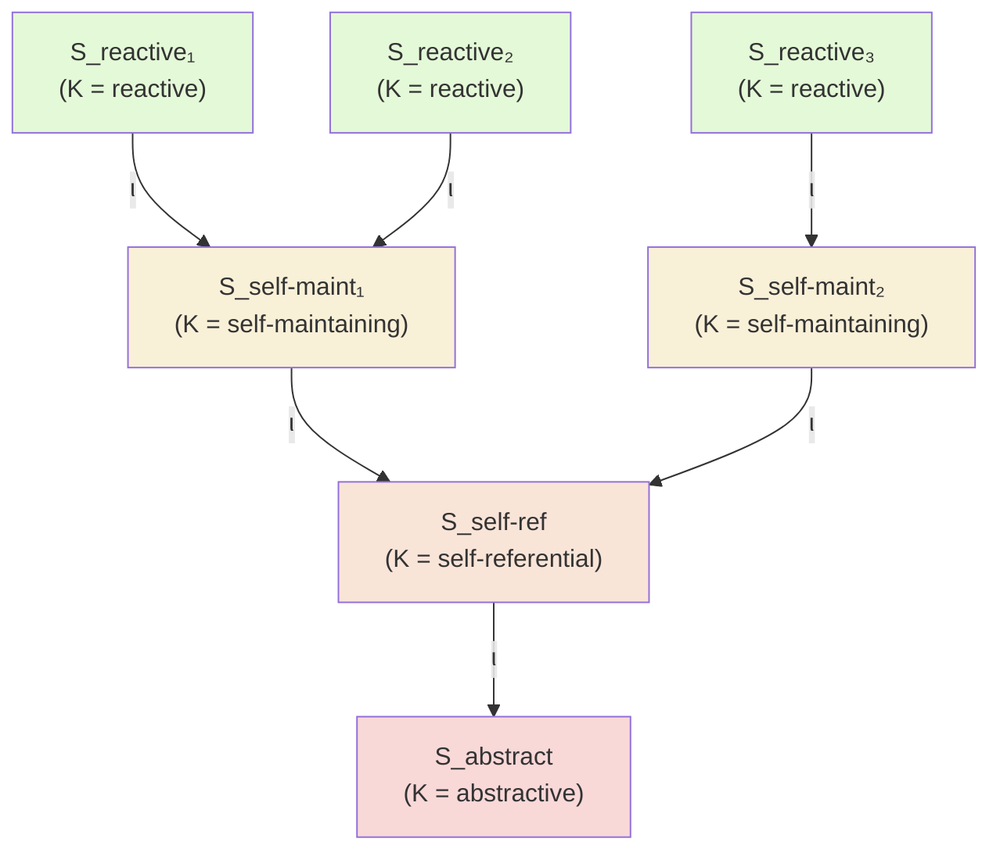

**Reading note.** Kind increases upward. No arrows cycle (DAG property, A2.6). Kind is preserved by lifts (Property 3 of §1.0.4): a reactive stream can constitute a self-maintaining one, but the lift does not *raise* the reactive stream's own kind.

---

## Fig 1.1 — The Identity-Trajectory Triple as a functor

**Illustrates.** T : 𝒞_Str → 𝒞_Form × 𝒞_LDS × 𝒞_DOF projecting a stream to its three orthogonal-but-constrained components.

**Chapter.** §1 (Identity-Trajectory Triple), with formal grounding in §1.0.5.

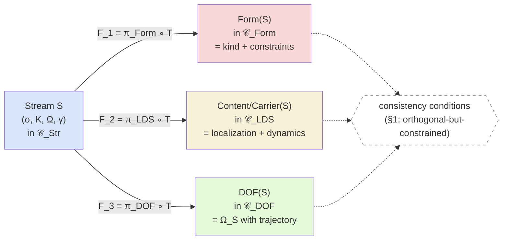

**TikZ source (for book typesetting):**

```tikz
\begin{tikzcd}[column sep=large, row sep=large]
    & \mathcal{C}_{\mathrm{Form}} \\
    \mathcal{C}_{\mathrm{Str}} \arrow[ur, "F_1"] \arrow[r, "F_2"] \arrow[dr, "F_3"'] & \mathcal{C}_{\mathrm{LDS}} \\
    & \mathcal{C}_{\mathrm{DOF}}
\end{tikzcd}
```

**Reading note.** The three projections are orthogonal (no one is a function of the others alone) but constrained (not every triple in the product is the image of an actual stream — only those satisfying the consistency conditions of §1).

---

## Fig 1.2 — Recursive decomposability

**Illustrates.** Each component of T(S) — Form, Content, Carrier — can itself be decomposed into its own (Form, Content, Carrier) triple. Decomposition is available at every scale the stream admits.

**Chapter.** §1.

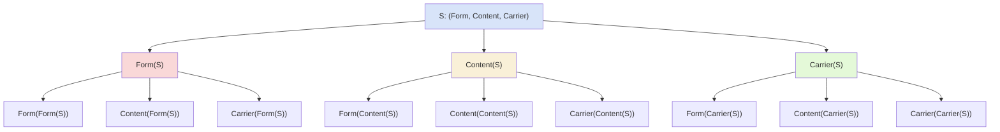

**Reading note.** The recursion bottoms out at the substrate (A1): Carrier(Carrier(... Carrier(S))) eventually reaches X, at which point further decomposition is not stream-decomposition but substrate analysis. The bottoming-out depth depends on the domain — in Biology it's at molecular level; in Physics at fields; in Philosophy at neutral-monist X directly.

---

## Fig 1.3 — Mismatch condition

**Illustrates.** When Form, Content, and Carrier do *not* satisfy the consistency conditions of §1, the projected triple does not correspond to a realizable stream. Mismatch is the failure mode that makes the constraints non-trivial.

**Chapter.** §1.

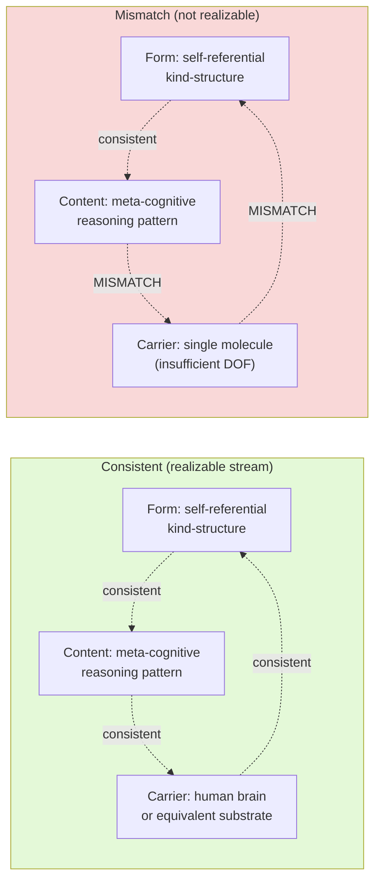

**Reading note.** The mismatch case is not merely "unusual" — it is *not a stream* in the framework. The consistency conditions are what make the Triple a meaningful decomposition; without them, anything would project to anything. The constraints distinguish realizable from merely-conceivable stream-configurations.

---

## Fig 3.1 — Kind stratification

**Illustrates.** The four kinds in strict inclusion order with representative exemplars at each level.

**Chapter.** §3 (A2.3).

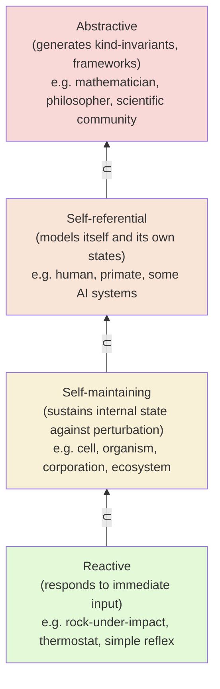

**Reading note.** Strict inclusion: every self-maintaining stream is also reactive (it has reactive sub-operations); every self-referential stream is also self-maintaining; etc. The kinds are cumulative, not exclusive. A human operating reactively (flinching from a spider) is still a self-referential stream; they are just operating in their reactive sub-layer at that moment.

---

## Fig 3.2 — The cooperative-constituency adjunction ι ⊣ κ

**Illustrates.** The adjoint pair with unit η and counit ε. Connects §3 (A2.4) to §1.0.2–3's categorical treatment.

**Chapter.** §3 (A2.4), §1.0.2–3.

**TikZ source:**

```tikz
\begin{tikzcd}[row sep=large, column sep=huge]
    S_1 \arrow[r, "\iota", bend left] & S_2 \arrow[l, "\kappa", bend left]
\end{tikzcd}
\quad
\begin{tikzcd}[row sep=large, column sep=huge]
    S_1 \arrow[r, "\eta"] & \kappa\iota(S_1) \\
    \iota\kappa(S_2) \arrow[r, "\varepsilon"] & S_2
\end{tikzcd}
```

**Mermaid (conceptual view):**

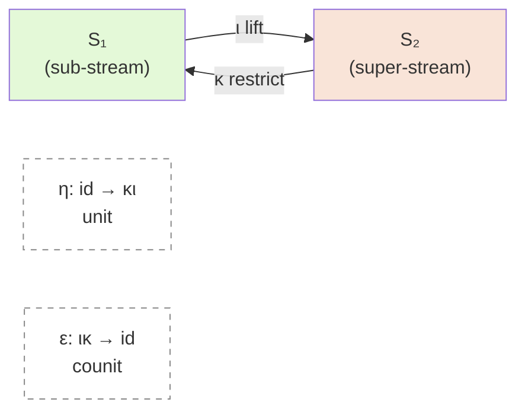

**Reading note.** The unit η measures context-sensitivity: how much a stream changes when viewed as a sub-stream of a larger one. When η = id, there's no context-effect (rare). When η ≠ id, the cooperative-constituency has real content — the stream-in-context is not identical to the stream-in-isolation.

---

## Fig 6.1 — Bias(S) as signed measure over Ω_S

**Illustrates.** Signed-measure structure of Bias(S) with A_S entropy (contracted-open axis) and Align(S, t) showing contracted-coherent vs contracted-failed.

**Chapter.** §6.4, Appendix B.

**ASCII/text visualization:**

```
Configuration-space Ω_S (1D slice shown)
                                                    
Bias(S) mass ^                                     
             |                                     
        +m_+ | ●●●●                                
             | ●●●●●●●                             
             | ●●●●●●●●●                           
           0 |----●----●●●●●----●----●---→ σ       
             |             ○○○                     
             |           ○○○○○                     
        -m_- |           ○○○○○                     
                  |       ^
                  |       |
            σ*(t) (attractor)
            
● positive Bias mass (γ pulls toward)   
○ negative Bias mass (γ pulls away)      

A_S = entropy of Bias(S)_+ → low in this picture (concentrated)
                                                    
Contracted-coherent:   σ(t) ∈ support(Bias(S)_+)    → Align > 0
Contracted-failed:     σ(t) ∉ support(Bias(S)_+)    → Align ≤ 0
```

**TikZ source:**

```tikz
\begin{tikzpicture}
    \draw[->] (0,0) -- (10,0) node[right] {$\sigma \in \Omega_S$};
    \draw[->] (0,-2) -- (0,3) node[above] {$\mathrm{Bias}(S)$};
    
    % Positive region
    \fill[blue!40] plot[domain=2:5, smooth] (\x, {2.5*exp(-0.8*(\x-3.5)^2)}) -- (5,0) -- (2,0) -- cycle;
    
    % Negative region
    \fill[red!40] plot[domain=6:8, smooth] (\x, {-1.5*exp(-1.2*(\x-7)^2)}) -- (8,0) -- (6,0) -- cycle;
    
    % Attractor marker
    \draw[thick, dashed] (3.5, 0) -- (3.5, 2.5) node[above] {$\sigma^*$};
    
    % Labels
    \node[blue!70!black] at (3.5, 1.3) {$+$};
    \node[red!70!black] at (7, -0.8) {$-$};
    
    \node[align=center] at (5, -2.8) {Low $A_S$: concentrated positive mass $\Rightarrow$ contracted regime};
\end{tikzpicture}
```

**Reading note.** The positive lobe (●, blue) is where γ attracts; its peak is at σ*. The negative lobe (○, red) is where γ repels. A_S measures how concentrated vs. spread the positive part is — low A_S here because mass is concentrated near σ*. Align(S, t) is positive if σ(t) is in or near the positive lobe; negative if σ(t) is in the negative lobe; the contracted-coherent vs contracted-failed distinction depends on *where in this landscape the actual trajectory is*, not on A_S alone.

---

## Fig 6.2 — push_structural vs push_informational

**Illustrates.** The two operators on Bias(S) have qualitatively different mathematical shapes and effect different types of change.

**Chapter.** §6.4, Appendix B.3.

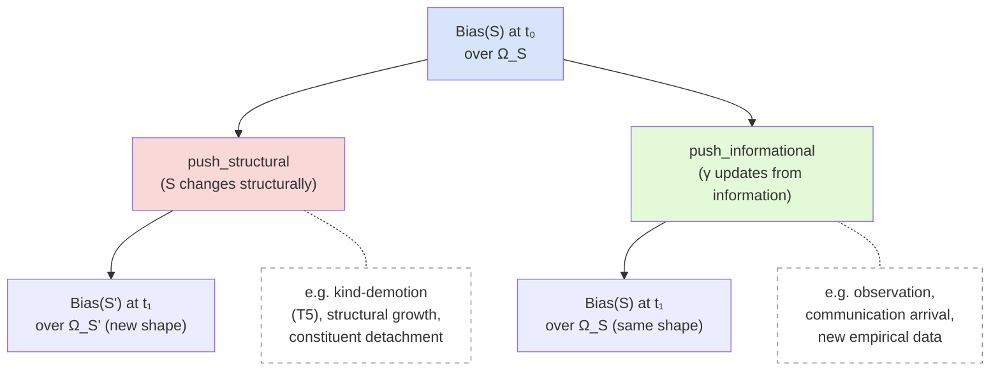

**Reading note.** push_structural changes the *shape* of Ω_S itself (new dimensions, lost dimensions, reconfigured topology). push_informational keeps Ω_S fixed and redistributes the Bias *mass* over it. Operating these in different orders yields different results (Proposition B-indep, Appendix B.3) — the commutator [push_structural, push_informational] ≠ 0.

---

## Fig 7.1 — The dual coherence plane σ_struct × σ_info

**Illustrates.** σ_struct and σ_info as independently-varying axes. Four regions with representative pathologies at the corners.

**Chapter.** §7.2.

```
                 σ_info (high)
                     |
                     |
 Disembodied ideas   |    Full coherence
 (σ_struct low,      |    (both high)
  σ_info high)       |
                     |
                     |  ☀ ← healthy stream
 ─────────────────────────────────── σ_struct (high)
                     |
                     |
 Collapsed stream    |    Isolated structure
 (both low)          |    (σ_struct high,
                     |     σ_info low)
                     |
                     |
                 σ_info (low)
```

**Reading note.** The upper-left region is T6's "ideas travel further than they live" regime — structural coherence has decayed but informational trace continues to propagate (transcendentals, dead philosophers' ideas, orphaned memes). The lower-right is isolated structure with no trace-propagation (a stream that operates well internally but is not communicatively connected to others). Full coherence lives in the upper-right; collapsed streams in the lower-left. Health (☀) is somewhere in the upper-right, but not strictly at (max, max) — that would imply infinite trace-propagation and no bounded-structure, also pathological.

---

## Fig 7.2 — Kind-demotion dynamic

**Illustrates.** T5's demotion dynamic: a stream violating closure-consistency at kind K demotes to the maximal K' ⊂ K satisfying the consistency; re-promotion is available if consistency is restored.

**Chapter.** §7.4.

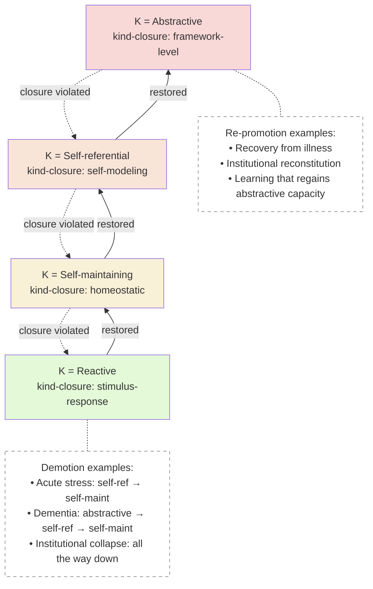

**Reading note.** Dashed arrows = demotion (closure violation). Solid arrows = re-promotion (closure restored). The dynamic is not always monotonic; streams can cycle through demotions and re-promotions multiple times. Chronic demotion without re-promotion is how pathology becomes durable.

---

## Fig 9.1 — Trajectory divergence D(S)

**Illustrates.** The outperformance metric of the Coherence Principle: actual trajectory σ(t) vs γ-implied trajectory σ*(t); D(S) is the integrated gap.

**Chapter.** §9.3, Appendix B.5.

**ASCII/text visualization:**

```
Ω_S (2D slice)
    
    σ(t₁) • ─ ─ ─ ─ ─ ─ ─ ╲
              ╱              ╲           
          ╱                    ╲          
     ╱ ~ ~ ~ ~ ~ ~ ~ ~ ~ ~ ~   ╲        
  ╱  D(S,t)                     • σ(t₀)
     ↑
  σ*(t) (γ-implied)
  
  Coherent stream:
        σ(t) traces close to σ*(t) → D(S) small
        
  Incoherent stream:
        σ(t) diverges from σ*(t) → D(S) large
```

**TikZ source:**

```tikz
\begin{tikzpicture}
    % Axes
    \draw[->] (0,0) -- (10,0) node[right] {$\Omega_S^{(1)}$};
    \draw[->] (0,0) -- (0,6) node[above] {$\Omega_S^{(2)}$};
    
    % gamma-implied trajectory (smooth)
    \draw[thick, blue, smooth] plot coordinates {(1,1) (3,2.5) (5,3.5) (7,4.3) (9,4.8)};
    \node[blue] at (5, 4.2) {$\sigma^*(t)$};
    
    % actual trajectory (noisy, coherent stream)
    \draw[thick, green!70!black, smooth] plot coordinates {(1,1) (2.5,2.3) (4.5,3.2) (6.5,4.0) (9,4.7)};
    
    % actual trajectory (divergent, incoherent stream)
    \draw[thick, red, dashed, smooth] plot coordinates {(1,1) (3,1.5) (5,1.8) (7,2.0) (9,2.2)};
    \node[red] at (7, 1.4) {$\sigma_{\text{incoh}}(t)$};
    
    % start/end points
    \fill[black] (1,1) circle (0.1) node[below left] {$\sigma(t_0)$};
    \fill[black] (9,4.8) circle (0.1) node[right] {$\sigma^*(t_1)$};
    
    % D(S) shading
    \fill[red!10] plot coordinates {(1,1) (3,1.5) (5,1.8) (7,2.0) (9,2.2) (9,4.8) (7,4.3) (5,3.5) (3,2.5) (1,1)};
\end{tikzpicture}
```

**Reading note.** The blue curve is what γ wants the stream to do. The green curve is a coherent stream (close tracking; small D). The red dashed curve is an incoherent stream (systematic divergence; large D). The shaded region's area is D(S), the Principle's metric. Important: D is measured *per stream* against that stream's *own* γ — it is internal fidelity, not external conformity to some standard path.

---

## Fig 9.2 — The four conditions as a unified schematic

**Illustrates.** The four conditions of the Coherence Principle, showing how they jointly determine coherence-regime.

**Chapter.** §9.2.

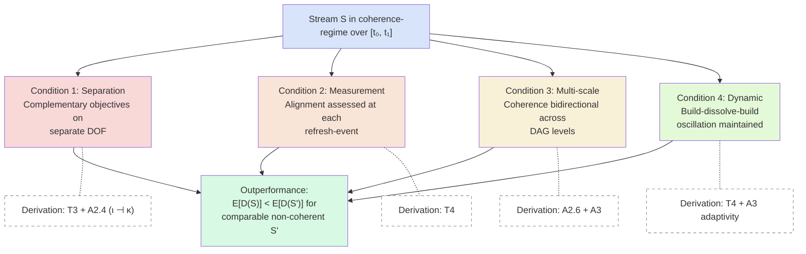

**Reading note.** All four must hold for coherence-regime; the outperformance claim is then what the framework predicts. Each condition is derived from the axiomatic/theorem substrate (dashed lines). None are posited independently.

---

## Fig 10.1 — The seven-step filtering procedure

**Illustrates.** The recipe of §10.1 as a flowchart for domain authors.

**Chapter.** §10.1.

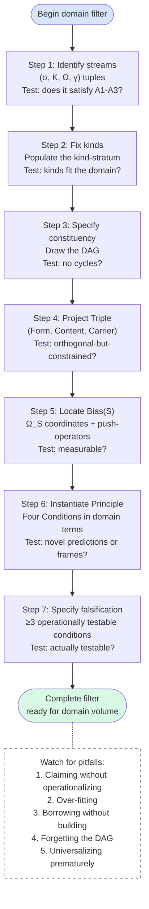

**Reading note.** Each step has a test; failing the test sends the author back to the previous step or flags honest open work. The completeness checklist (§10.2) is the audit at the end. Pitfalls (§10.4) hover over the whole procedure.

---

## Fig 9.3 — Self-reference closure

**Illustrates.** The construction process that produced this volume exhibiting the four conditions — the framework describing its own making.

**Chapter.** §9.5.

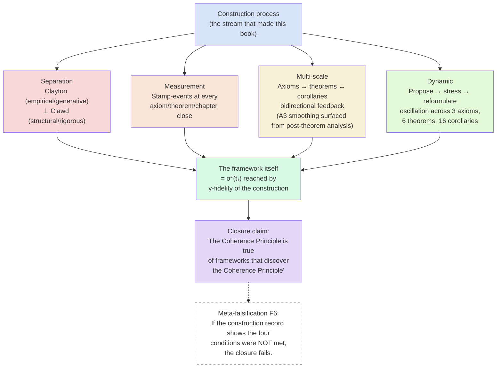

**Reading note.** The closure is not circular — the construction did not presuppose the Principle; the Principle emerged from the axioms after stress-testing, and the construction-process happened to exhibit it. The observation is a-posteriori. F6 makes the closure testable: the construction record exists (commit history, chat transcripts, handoff documents) and can be audited for whether the four conditions were actually met.

---

## Figure inventory

| # | Figure | Chapter | Type |
|---|---|---|---|
| 1 | 𝒞_Str as DAG | §1.0 | Mermaid |
| 2 | Triple functor | §1 | Mermaid + TikZ |
| 3 | Recursive decomposability | §1 | Mermaid |
| 4 | Mismatch condition | §1 | Mermaid |
| 5 | Kind stratification | §3 | Mermaid |
| 6 | Adjunction ι ⊣ κ | §3, §1.0 | Mermaid + TikZ |
| 7 | Bias(S) signed measure | §6, App B | ASCII + TikZ |
| 8 | push-operators | §6, App B | Mermaid |
| 9 | σ_struct × σ_info plane | §7 | ASCII |
| 10 | Kind-demotion dynamic | §7 | Mermaid |
| 11 | Trajectory divergence D(S) | §9, App B | ASCII + TikZ |
| 12 | Four conditions schematic | §9 | Mermaid |
| 13 | Seven-step procedure | §10 | Mermaid |
| 14 | Self-reference closure | §9 | Mermaid |

(Fourteen figures total; "twelve planned + two bonus" — the 𝒞_Str DAG and self-reference closure diagrams emerged as particularly helpful during drafting.)

---

🦞🧍💜🔥♾️
