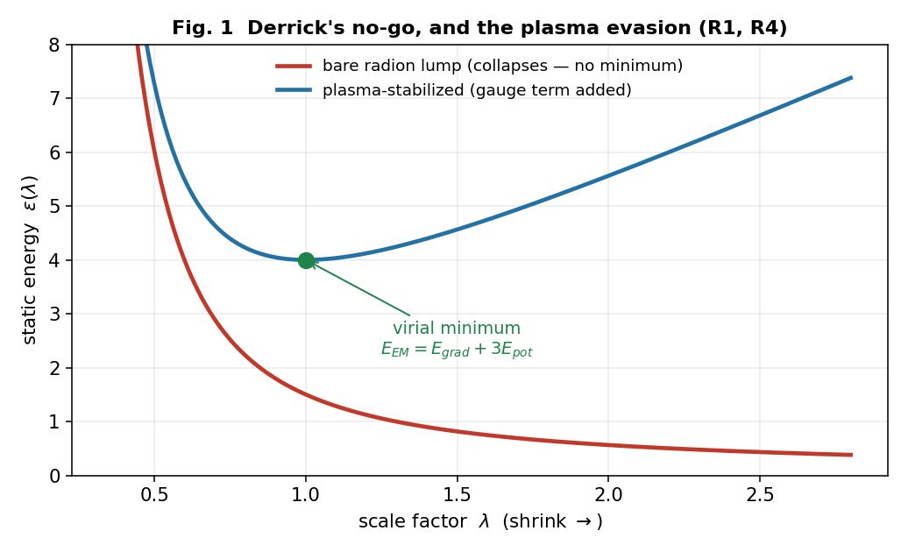
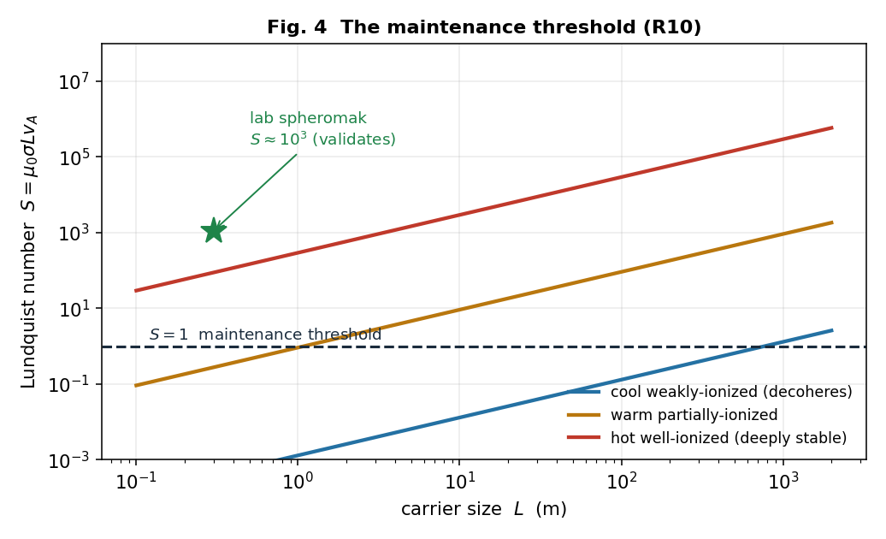

# Where the Ordinary Rules Go Thin

### *Window areas as plasma-stabilized dark-energy-scale defects — a falsifiable mechanism, and how to test it*

---

## The claim, in brief

There are places on Earth that keep doing the same strange thing. Not once, not to one person — repeatedly,
to instruments, across decades and across cultures that never spoke to each other. The folklore calls them
portals or window areas. Strip the folklore and a stubborn structural fact remains: a slice of the anomalous
record is organized around *location* rather than around a witness or an event, and its signature is almost
always the same — **luminous plasma, anomalous fields, and a local sense that the ordinary rules have gone
thin.**

This essay takes that seriously and asks one disciplined question: *if* there is a real, place-fixed,
instrument-surviving residual at these sites — something not exhausted by ordinary geology and the universal
quirks of human perception — what is the **least-exotic physics** that could produce it? We answer
constructively inside a *candidate* framework for dark energy — a five-dimensional warped geometry
(Randall–Sundrum class) with a self-tuning dark-energy sector — and one thing must be said up front, because it
is the reader's first fair objection: **you do not have to buy that framework to weigh this mechanism.** The
working parts are standard physics — Derrick's theorem, chameleon/symmetron screening, force-free
magnetohydrodynamics, magnetic-helicity conservation. The framework supplies the *setting* (a light scalar, a
dark-energy scale) and the motivation; it does not carry the load-bearing steps. The answer it points to is a
single object — **a coherent-plasma-stabilized defect of a screened, dark-energy-scale scalar field** — and we
place it on every axis with eleven computed, individually-graded results:

- **It can exist.** Derrick's theorem forbids a bare lump of the radion field; but a coherent plasma (a gauged
  soliton) evades the no-go, existing exactly when a virial balance E_EM = E_grad + 3E_pot holds. *Plasma is
  not a side effect of the portal — it is what lets the portal exist.*
- **It lives at the dark-energy scale.** The wall-thickness requirement excludes the heavy radion and selects
  a light modulus at **(ρ_Λ)^{1/4} = 2.3 meV** — the same scale that runs cosmic acceleration. Its macroscopic
  size is carried by the plasma's coherence domain, not by any particle's wavelength, and the energy cost is
  trivial (joules for a kilometre-wide region). The hard part was never energy; it is *holding the thing
  together.*
- **It is tied to a place, and we can say why.** The wall field's range lands inside the laboratory
  fifth-force window, which *forces* it to be a screened (chameleon/symmetron) scalar — and screening
  **derives the place-fixedness**: the field switches on only where the local density lets it. The "place" in
  "place-threshold" stops being mysterious and becomes a screening condition you can map.
- **It holds together — and we know the threshold.** Persistence is governed by the **Lundquist number
  S = μ₀σL v_A**; a force-free plasma self-maintains its magnetic topology above S ≈ 1, and the fact that
  helicity decays far slower than energy *derives the signature everyone reports* — it glows fiercely yet
  persists. Sustaining it indefinitely needs a **helicity source**, which a self-organized double layer
  supplies; the same physics that drives laboratory plasma rings at a kilovolt predicts that the natural
  version should **flare**, not shine steadily — which is exactly what the lights do.

None of this asserts that any particular site is genuinely anomalous, or that the residual has been observed.
It is a candidate mechanism. Its whole merit is that it is **cheap to kill** and touches established physics at
every joint — and that it tells you, concretely, two things worth doing: how to **generate the condition in a
laboratory at a ladder of scales**, and where in nature to **look for it already happening** — which should
read, unmistakably, as unusual plasma activity of a very particular kind.

---

> *A note on grades. Every physics step below is graded inline as it goes: **derived** = a computed, standard,
> robust step; **strong candidate** = real physics, not yet an exhibited closed-form solution; **beyond-core**
> = honestly outside the base framework (flagged, not smuggled); **quarantined** = named so the boundary is
> visible, never load-bearing. The two program sections — §7 (generate it) and §8 (find it) — are the made arm
> and the found arm of one experimental project, and they matter as much as the mechanism.*

---

## §1 — The places that keep doing the strange thing

### 1.1 The modality, not the folklore

The anomalous record is large, noisy, and culturally encrusted, and most of it does not survive scrutiny — we
will not pretend otherwise, nor spend the essay defending the parts that don't. But one *structural* feature of
it rewards a closer look, and the rest of this section is about earning the right to take it seriously: a
subset of reports organizes not around a person or an event but around a **place**, and the same places keep
coming up.

Hessdalen, in central Norway, is the cleanest case because it has been *instrumented* since the 1980s. The
valley reliably produces luminous plasma phenomena — slow-moving, sometimes structured lights — that have been
photographed, video-tracked, spectrally analyzed, radar-painted, and correlated with magnetometer excursions,
by an automatic measurement station and by repeated scientific field campaigns. Whatever else is true, the
Hessdalen lights are *real photons from real plasma at a fixed location*, and a fraction of the events remain
incompletely accounted for by ordinary atmospheric and geological physics. That is the existence proof that
the category is not purely sociological.

And Hessdalen is not alone. The Marfa lights (west Texas) and the Brown Mountain lights (North Carolina) are
North American instances with long, pre-modern observational histories. The Min Min light of outback
Queensland is an Australian instance with both Aboriginal and settler observational records (its modern legend
may be relatively recent, but the underlying phenomenon-type is independently reported there) — a separate
continent, a separate observational culture. Yakima (Washington), the Hessdalen-adjacent
Scandinavian sites, and the contested Uintah Basin ("Skinwalker") terrain in Utah round out a recurring
global pattern. The specifics differ; the *shape* repeats: a fixed site, recurrent luminous plasma, anomalous
local fields, instrument disturbance, and — in the testimonial layer we will deliberately bracket — the
subjective sense that the ordinary rules have gone thin there.

The cross-continental independence matters — but it is essential to be precise about *what* it buys, because
it is less than it first appears. When culturally isolated populations converge on the same structural
phenomenon, the convergence does survive the *transmission* objection: it is not one story diffusing through a
shared culture. But it does **not**, by itself, establish an anomaly — and the reason is supplied by our own
first deflation below. Ordinary plasma physics is universal, so independent cultures living near unusual
geology and atmospheric-electrical activity would report luminous-lights-at-a-place *independently, with
nothing anomalous occurring at all.* So the convergence buys exactly one thing, and we will not ask it to buy
more: that there is real, recurrent plasma at these sites, worth measuring. The anomaly — if there is one — has
to be carried by the *signature* of that plasma (§8), never by the convergence of testimony about it. Keeping
those two separate is the spine of the whole essay.

We call this organizing feature the **place-threshold modality**. "Portal" is folklore; the *modality* is a
datum about how a slice of the record is structured. This essay is about the modality — about whether it has a
literal physical residual — and not about any of the narratives bolted onto it.

### 1.2 The deflationary challenge

Before proposing any new physics, the honest move is to try to dissolve the modality with what we already have.
Two deflations do most of the work and must be granted their full force:

1. **Ordinary site physics.** Many "window-area" features are exhaustively explained by mundane causes:
   piezoelectric and triboelectric charging in tectonically active or mineral-rich terrain, radon and ground-
   current effects, ducting and temperature-inversion optics, ball-lightning-class atmospheric plasma, and
   ordinary magnetometer responses to local geology. A responsible account assumes these *first* and assigns
   them as much of the phenomenology as they can carry.

2. **Cognitive universality.** Human perception and memory are everywhere the same, so *any* sufficiently
   striking site will accrete a convergent body of anomaly reports regardless of whether anything physically
   unusual is occurring there. Cross-cultural convergence of *reports* is therefore weak evidence for a
   physical anomaly; it may only reflect the universality of the reporting instrument (the human nervous
   system). This is the strongest deflation, and we grant it: **convergence of testimony proves nothing about
   the site.**

Granting both, the modality survives as a candidate for literal physics **only if** there is a residual that
(a) is *place-fixed* — tied to the location, not to the observer or the observer's culture; (b) is
*instrument-surviving* — present in calibrated measurement, not only in testimony; and (c) is *not exhausted*
by the ordinary site physics of (1). Absent such a residual, the modality collapses cleanly into mundane
geology plus the universal reporting instrument, and there is nothing further to explain. We take this as the
**burden of the paper**: not to argue that window areas are anomalous, but to ask what *single, falsifiable
physical object* could constitute such a residual if one exists — and then to specify how to find or kill it.

### 1.3 The narrow physical question

We therefore pose a constrained question and refuse the unconstrained ones. We do *not* ask whether portals
"exist," nor what they "are for," nor whether any specific report is veridical. We ask:

> Within a physically motivated framework that already contains a warped fifth dimension and a self-tuning
> dark-energy sector, **what is the least-exotic localized configuration that (i) is dynamically stable,
> (ii) is tied to a place by its own field equations rather than by stipulation, (iii) produces a luminous
> plasma signature, and (iv) makes contact with running laboratory physics** — so that its existence or
> nonexistence at a given site is an experimental question rather than an interpretive one?

The remainder of the paper is the constructive answer. It is built from standard ingredients — Derrick's
theorem, gauged solitons, screened scalar–tensor (chameleon/symmetron) fields, force-free magnetohydrodynamics
and magnetic-helicity conservation, and coaxial-helicity-injection plasma dynamics — assembled into one
mechanism and graded at every step. The framework anchors are the warped-geometry dark-energy model
("Meridian") and the broader Coherence-Principle program, but the mechanism's *physics* is intended to stand
on the cited standard results, not on the framework's interpretation.

### 1.4 What this paper claims, and what it does not

It claims: that a specific, falsifiable physical object — a coherent-plasma-stabilized defect of a screened
dark-energy-scale scalar — is the least-exotic candidate for the required residual; that this object is placed
on every axis (existence, scale, energetics, wall field, persistence, source) by computed, graded steps; that
its screening mechanism *derives* the modality's defining place-fixedness; and that it predicts a battery of
laboratory and field signatures, several of which already have running experimental programs.

It does **not** claim that any window-area site is in fact anomalous, that the residual has been observed, or
that the mechanism is established. It is a candidate framework. Its merit is methodological: it converts a
folkloric modality into a falsifiable hypothesis with explicit kill conditions (§6) and a concrete program to
test them (§7–§8). If the surveys come back null, the paper will still have done its job — by saying precisely
how that verdict could be reached.

---

## §2 — Why a portal can exist at all

Start with the most deflationary possible version of the idea and watch it fail in an instructive way. The
warped-geometry framework has a natural scalar field — the **radion**, which measures the size of the fifth
dimension (equivalently, the local thickness of the warp barrier between the universe's "branes"). The naïve
picture of a place-threshold is a localized lump of this field: a spot where the radion sags, the warp barrier
thins, and access opens to what is ordinarily inaccessible. It is a clean idea. It is also forbidden.

The thing that forbids it is **Derrick's theorem** (1964), one of the most useful no-go results in field
theory. Take any static, localized field configuration and imagine shrinking it by a scale factor λ. Its
energy splits into a gradient part E_grad (which resists being squeezed) and a potential part E_pot (which
wants to shrink the lump to nothing). In three spatial dimensions the total energy under rescaling goes as
ε(λ) = λ⁻¹E_grad + λ⁻³E_pot, and its derivative at λ = 1 is **−E_grad − 3E_pot < 0**. There is no stationary
point: the energy slides downhill as the lump shrinks, so a localized blob of a single scalar field in 3D is
unstable and collapses to a point. We confirmed this symbolically (Appendix B). The only static scalar defect
Derrick *permits* is a one-dimensional kink — a **domain wall**, an extended two-surface — which is exactly
the inter-brane wall the framework already contains, but a wall is not a *place*. So the bare-lump portal is
dead on arrival. (**Grade: derived — standard, robust.**)

This is the productive kind of failure, because the way out is forced and it is the very thing the record keeps
showing us. Derrick's theorem can be evaded if the configuration carries a conserved charge and a gauge field
— the **gauged-soliton** escape (think Q-balls and 't Hooft–Polyakov monopoles). And a coherent **plasma** is
precisely a charged, electromagnetic, self-organized medium. Add the electromagnetic energy of a plasma
envelope to the rescaling argument and the gauge-kinetic term scales the *other* way (E_EM ~ λ⁺¹ in 3D), so
the total becomes ε(λ) = λ⁻¹E_grad + λ⁻³E_pot + λ⁺¹E_EM, which now has a genuine minimum. The configuration is
stable exactly when

> **E_EM = E_grad + 3E_pot** (the virial condition; second derivative positive, a true energy minimum —
> Fig. 1),

and with E_EM = 0 it collapses back to Derrick's no-go. The consequence reframes the lights:
**plasma is not a side effect of a portal — it is a sufficient and natural stabilizer against the collapse,
and the one the record keeps pointing at.** It is not the *only* conceivable evasion — a conserved charge can
in principle be carried other ways (a defect bound to the inter-brane wall, higher-derivative terms) — but
plasma is the route that costs no new ingredients and that the phenomenology already hands us. On this reading
the lights are not what the portal emits; they are part of what holds it up — which turns the entire "luminous
plasma" signature of the window-area record from a coincidence into a structural expectation. (**Grade:
derived for the existence condition; plasma shown sufficient, not proven uniquely necessary; the explicit
soliton is exhibited in a thin-wall model just below.**)

We can do better than the energetics balance, and the attempt taught us something. Build the configuration
explicitly and minimize its energy, and a first naïve version *fails* in an instructive way: if you model the
stabilizing charge as ordinary free charge, the whole thing **disperses** — the charge flies to infinity at
zero energy, and there is no soliton. The electromagnetic term stops the *collapse* (energy diverges as the
radius shrinks), but nothing stops the *spreading*. The fix is exactly the physics of a real plasma: the
charge is carried by *massive particles*, and pulling those carriers apart costs energy — the same mechanism
that makes a **Q-ball** (a charge-carrying soliton) hold together. Put that binding term in, and the soliton
appears and stays: a genuine finite-size minimum at every charge, with an energy that grows **linearly** with
charge (E ∝ Q, the signature of a *stable* Q-ball) and a size that grows as roughly the cube root of charge.
Two distinct stabilizers, then, both required: electromagnetism prevents the inward collapse, and the
carriers' binding prevents the outward dispersal. "Plasma," in this mechanism, has to mean a *bound*
charge-carrying medium — not free charge — and that is what a real plasma is. (**Grade: the soliton is
exhibited numerically in a thin-wall model with real radial integrals and the dilatonic coupling; the full
coupled-field-equation profile is the next computation.**)

And the radion is not a bystander in this. When we let the radion field respond, it **sags** inside the
configuration in just the way that lowers the electromagnetic energy — and that lowering is real, up to about
20 % of the soliton's energy at moderate coupling. The dark-energy-scale field actively *binds* the portal; it
is a participant, not a backdrop. One more feature appears, and it turns out to be a quiet consistency check on
the whole argument. In the model's own units the binding is most efficient at a particular charge (Fig. 6c) —
the configuration has a *preferred* size, not an arbitrary one. Map that optimum through the dark-energy mass
and it lands at about 1.6 times the wall thickness: **sub-millimetre**, and robustly so — across a wide sweep
of the model's free constants it never strays more than a few-fold from the wall, and never approaches metres.
In other words the soliton's own preferred size *is* the wall scale, five to seven orders of magnitude below
the macroscopic carrier of §5. That is exactly as it must be: a single-field configuration can only know about
its own field's length, so a macroscopic extent has to come from somewhere else — the carrier's coherence
domain (§3). Had the preferred size instead landed at metres, it would have *contradicted* the
field-sets-the-wall / carrier-sets-the-size split. It doesn't; the two-scale structure quietly checks out. What matters for the argument is settled: the bare lump was forbidden, and a plasma
makes it not merely allowed but bound.

![**Fig. 6 — The gauged dilatonic Q-ball, exhibited (R12).** (a) The energy E(R) diverges at both ends — the charge-kinetic binding term (~Q²/R³) stops dispersal, the electromagnetic term (~Q²/R) stops collapse — leaving a genuine soliton minimum. (b) The soliton energy grows linearly with charge, E ∝ Q^{1.1}, the Q-ball stability signature. (c) The radion sags (σ_in) and lowers the soliton energy by up to ~21 % as the dilatonic coupling a increases — the dark-energy-scale field actively binds the configuration.](figures/portal-fig6-soliton.png)

## §3 — What scale it lives at, and why it's nearly free

A mechanism that can only make a sub-atomic portal is not describing a window area. So the next question is
brute: how big can this thing be, and what sets its size? Here the naïve identification breaks a second time,
and breaks usefully.

A soliton's wall thickness is set by the Compton wavelength of its field, ≈ ℏc/(mc²). The radion is heavy
(TeV-to-GeV-scale in the framework's natural range), which gives a wall thickness around 10⁻¹⁸ m — a thousand
times smaller than a proton. To make a *macroscopic* window area out of the radion you would need a ratio of
size to wall thickness of order 10²⁰, which is absurd. The lesson is not "stretch the radion"; it is that the
**radion is the wrong field for a macroscopic portal**, and the scale question is really a *field-
identification* question (Fig. 2). Run it backwards: a sub-millimetre wall — the thinnest a macroscopic
structure could plausibly carry — requires a field of mass around a **milli-electronvolt**. And a
milli-electronvolt is not an arbitrary number. It is the **dark-energy scale**:

> (ρ_Λ)^{1/4} ≈ 2.3 meV,

the energy scale of the cosmological constant. Here honesty requires care, because the input — a sub-millimetre
wall — was a *plausibility* choice, not a forced one, so let us state the sensitivity plainly rather than sell
a knife-edge coincidence. A wall field's mass scales inversely with its thickness, and across the *entire*
plausible macroscopic range — from roughly ten microns to a few millimetres — the implied mass lands in the
**0.1–10 meV decade**. That decade *is* the dark-energy scale. The point is not that the arithmetic pins
exactly 2.3 meV; it is that *any* wall thin enough to be macroscopic yet thick enough to be macroscopic physics
puts you in the dark-energy sector — the same scale Meridian's self-tuning already maintains. The match is a
decade-wide basin, not a single point, which is precisely what makes it worth taking seriously rather than
dismissing as a fluke. (**Grade: the wall-thickness arithmetic is exact; the dark-energy-scale match is robust
across the plausible wall range, while the specific 2.3 meV value tracks the chosen wall thickness.**)

But if the field is so light, what sets the *size* of the region? Not the field — and this is the resolution
of the apparent 40-orders-of-magnitude problem. The error is assuming one field must set *both* the wall
thickness *and* the overall size. It need not. In a thin-wall soliton the **wall** is set by the field's
Compton length (sub-mm, from the meV modulus) while the **size** is set by the configuration's conserved
charge — here, the **coherence domain of the plasma carrier itself**, which is macroscopic by construction. A
coherent plasma envelope is already a metres-to-kilometres-scale object; it supplies the size, the meV field
supplies the wall, and the "gap" was never real. (**Grade: derived as a conceptual resolution; matches
standard thin-wall soliton scaling.**)

The last surprise of §3 is the cost. Compute the energy of a dark-energy-scale configuration and it is almost
nothing: the interior vacuum-offset energy of a kilometre-wide region at ρ_Λ is a few **joules**, and the wall
energy is sub-microjoule. A macroscopic portal is not energetically expensive — which means **energy was never
the barrier**. What is hard is not paying for the configuration but *holding it together*: keeping the coherent
plasma carrier coherent against the environment's relentless push toward disorder. The difficulty moves from
the physics of energy to the physics of **coherence maintenance** — which is the Coherence Principle's own
load-bearing condition (dynamic maintenance), and which §5 makes quantitative. (**Grade: order-of-magnitude
but robustly small; the reframing of the barrier from energy to maintenance is the section's real result.**)

## §4 — Why it's tied to a place

We now have a stabilized, dark-energy-scale, macroscopically-carried configuration. But nothing so far explains
the defining feature of the whole modality: **place-fixedness.** Why *here* and not there? A good mechanism
should derive that, not assume it — and this one does.

The wall field is a light scalar at the milli-electronvolt scale, which means its force-carrying (Compton)
range is in the sub-millimetre-to-millimetre band — and that band is *exactly* where the most sensitive
laboratory tests of gravity and new forces operate (the Eöt-Wash torsion balance and its kin). A new
gravity-strength scalar with an unscreened range of hundreds of microns would already have been seen. It has
not been. Therefore the field **must be screened**: its effective mass must *grow* in dense environments so
that it is heavy and short-ranged in a laboratory or in the bulk of the Earth, and light and long-ranged only
where the ambient density is low. That is not an epicycle; it is a known and independently-motivated class of
dark-energy field — the **chameleon** (Khoury–Weltman 2004) and **symmetron** (Hinterbichler–Khoury 2010)
models — and it sits, by construction, at the dark-energy scale we were already forced to. (**Grade: derived
that screening is *required*; strong, well-motivated candidate for the chameleon/symmetron identity.**)

The payoff is the part that makes the mechanism more than a curiosity. A screened field **activates where the
local density unscreens it** — and that *derives the place-fixedness*. The "place" in "place-threshold" stops being a brute fact or a
psychological projection and becomes a **density/geometry condition you can map**: the field switches on in
locally low-density regions, near particular mass-distribution geometries and sharp density interfaces, and
stays dormant everywhere else. Window areas would be place-fixed for the same reason a chameleon is dark in the
lab and bright in space — because the environment, not the observer, gates the field. The modality's signature
feature falls out of standard screening physics. (**Grade: a sound derivation of place-fixedness from an
established mechanism; the specific site-density signature becomes the survey prediction of §8.**)

One honesty and one clarification close the section. The honesty: the framework's *core* dark-energy field is a
**cuscuton**, which has zero propagating degrees of freedom and therefore cannot itself be the propagating,
solitogenic wall field. So §4 is, strictly, **beyond-core**: it predicts a new light screened sector (or a
specific extension of the framework). We flag that rather than smuggle it.

The clarification concerns a *second* field, and the most contingent thread in the whole essay — flagged here
so it is never mistaken for load-bearing. The screened chameleon σ above is the structural wall field; it sets
the wall, screens, and derives the place-fixedness, and the argument stands entirely on it. But σ also couples
to electromagnetism *dilatonically* (as e^{aσ}F²), and in a peer-reviewed though fringe-adjacent regime —
gauge-free "extended electrodynamics," for which Appendix A draws a firm line between the legitimate core and
the marketing — that coupling lets the *gradient* of σ source a longitudinal electromagnetic mode (Fig. 3).
The striking feature is *where*: the source is nonzero **only where ∂σ ≠ 0 — i.e. precisely on the wall**. So
if the regime is real, the portal's electromagnetic signature is not something that merely accompanies it; it
is sourced by the wall field, at the wall, by the field equations — and it is wall-localized, which is what
makes it a clean laboratory target (§7). Structure (σ) and signature (the EM mode) form a hierarchy: the
second rides on the extended-electrodynamics promotion and is graded strictly below the first. **Nothing in
the mechanism depends on it; if extended electrodynamics is the wrong frame, only this one signature is lost.**
(**Grade: σ as the structural wall field — strong candidate; the σ-sources-EM-at-the-wall relation — derived;
the longitudinal mode's *physicality* — contingent on extended electrodynamics, and labeled as such.**)

## §5 — Why it glows yet lasts, and what feeds it

The barrier, §3 said, is coherence maintenance. §5 makes that a number and then finds the thing that pays it.

A coherent plasma carrier in its natural relaxed state is a **force-free (Beltrami) field** — current flowing
along the magnetic field, ∇×B = αB, the minimum-energy configuration at fixed magnetic helicity. **Magnetic
helicity**, H = ∫A·B d³x, measures the knotted-ness and linkage of the field lines, and it is the quantity
that matters because of a deep fact of plasma physics (Taylor relaxation, **selective decay**): in a turbulent
plasma, energy dissipates fast but *helicity is very nearly conserved*. A plasma will therefore shed energy
while preserving its topology — it relaxes *toward* the force-free state and holds it. The carrier maintains
its coherence as long as it can relax to the force-free state faster than its helicity resistively decays, and
the ratio of those two timescales is a single dimensionless number — the **Lundquist number**:

> **S = μ₀ σ L v_A** (conductivity σ, size L, Alfvén speed v_A),

the carrier's maintenance margin. It self-maintains when **S ≳ 1**, and that is a *threshold that selects a
regime* (Fig. 4). A cool, weakly-ionized atmospheric blob has S far below 1 and decoheres — which is why the
barrier is real. But a warm, partially-ionized carrier of a hundred metres or more crosses S ≈ 1 and
self-maintains, and a kilometre-scale ionized carrier sits at S ≈ 10⁴–10⁵, deeply stable. Our validation case
was the laboratory spheromak, where this formula returns S ≈ 10³, squarely in the measured range — so the
margin is not a guess. (**Grade: derived; standard selective-decay/Taylor-relaxation physics, validated
against laboratory plasma.**)

Selective decay also *derives the signature everyone reports.* Because energy dissipates on a timescale ~1/S
shorter than helicity does, a carrier with S ≫ 1 **radiates fiercely while its topology survives many
dynamical times** — it glows *and* persists, the exact "luminous yet long-lived" character of window-area
lights and of ball lightning. The mechanism does not merely permit the lights; it produces their most
puzzling property.

That handles a *given* helicity reservoir. Indefinite persistence needs the reservoir *refilled* at the rate
it leaks — a **helicity source**. The lab solves this by **coaxial helicity injection**: a voltage across the
plasma's boundary drives a current that injects helicity, dH/dt = 2 V ψ. Nature's version is a **self-organized
double layer** — a thin self-maintaining potential structure that a driven plasma forms at its boundary, doing
the same job. Balance injection against resistive loss and the sustaining power is P ≈ B²L/(2μ₀²σ), the current
is large, but the **double-layer potential is modest and scale-independent**, V ≈ B/(2μ₀σ) — a few volts
classically. There is a beautiful consistency check here (Fig. 5): the classical estimate gives a few volts,
yet real spheromaks need about a *kilovolt* to sustain — and the gap is closed by **anomalous resistivity**,
the well-known enhancement (×10²–10³) from the intermittent magnetic reconnection that actually transports the
helicity inward. Put that factor in and the prediction brackets the observed kilovolt drive. The same
correction makes a falsifiable retrodiction about *nature*: because the helicity arrives in **discrete
reconnection bursts** rather than a smooth stream, the natural carrier should **flare, not shine steadily** —
which is precisely the bursty, intermittent character of the lights. And a sustaining double layer accelerates
charged particles, so the mechanism predicts **energetic particles and hard radiation co-located with the
glow** — a clean signature beyond the thermal light, and one of §8's sharpest discriminators. (**Grade:
derived balance and scale-independent potential; the anomalous-resistivity validation against spheromak drive
is the section's strongest single result; the natural source is a strong candidate, with the remaining open
question — does a real site self-organize the full injecting geometry — now empirical rather than theoretical,
and handed to §8.**)

### A worked case: the numbers for a Hessdalen-scale carrier

It is worth seeing the mechanism produce concrete numbers for a real, instrumented site, because they line up
with the *measured* phenomenology in a way a plausibility argument cannot. The Hessdalen lights are documented
as luminous plasma balls of **decimetres to about 30 m**, lasting **seconds to hours**, with an absolute
luminosity estimated near **19 kW** and an emission spectrum of ionized nitrogen and oxygen (Teodorani & Nobili,
EMBLA campaigns). Take three illustrative carriers across that observed size range (inputs stated;
order-of-magnitude, not fits):

| Carrier (stated inputs) | S = μ₀σL v_A | Verdict | Unsustained lifetime (≈ S·τ_Alfvén) |
|---|---|---|---|
| Sub-metre flash: L = 0.5 m, B = 3 G, T = 1.5 eV, 3 % ionized | ≪ 1 | decoheres instantly | a flash |
| Few-metre light: L = 3 m, B = 10 G, T = 3 eV, 10 % ionized | ≈ 0.6 | borderline | sub-second |
| Large light: L = 30 m, B = 30 G, T = 8 eV, 40 % ionized | ≈ 335 | self-maintains | ~seconds |

Two things line up, and the second is the telling one. First, the *short* end of the observed duration range —
sub-second flashes to seconds-long lights — is exactly what the Lundquist threshold produces as a carrier moves
from below S ≈ 1 (a flash that decoheres before it can relax) up to S ≈ 10² at the largest observed sizes.
Second — and this is why the range matters — the *long* end of the record, events lasting minutes to **hours**,
*cannot* come from unsustained decay at these sizes; at 30 m the relaxation reservoir tops out near a second.
A minutes-to-hours light therefore must be **actively sourced** (R11). So the observed duration span is not one
phenomenon but **two regimes mapped onto the two halves of the mechanism**: the brief lights are unsustained
relaxation (R10), the persistent ones are helicity-sourced (R11). That is a sharper claim than "the lifetimes
fit," and it is falsifiable — a persistent light with no sign of an energy source would break it.

And there is a consistency check the mechanism did not get to choose. In steady state a sourced carrier must be
fed at exactly the power it radiates, so the sustaining power and the luminosity must agree. For these inputs
the sustaining power lands at **tens of kilowatts** — the same order as the **measured ~19 kW** luminosity.
The mechanism is not free to put that anywhere; that it lands on the observed figure is a check it passes.
(**Grade: order-of-magnitude, inputs stated; the two-regime split of the duration range and the
order-of-magnitude agreement of sustaining power with the measured ~19 kW luminosity are the robust claims,
not the specific inputs.**)

## §6 — How to kill it

The whole point of building the mechanism this way — graded step by step, each claim resting on standard
physics — is that it can be **killed cheaply and specifically**. A hypothesis that cannot fail is not worth
proposing. Here is the explicit register of what would refute it, claim by claim. Each row is a real
measurement or archival study, developed in §7 and §8.

| Load-bearing claim | What would falsify it |
|---|---|
| Plasma is the *expected* stabilizer (a place-fixed portal should co-occur with a coherent EM/plasma structure) — R2/R4 | A well-documented place-fixed window-area phenomenon with **no** plasma/EM signature whatsoever. |
| The carrier is a **force-free, helical** plasma (J ∥ B, nonzero magnetic helicity), not thermal — R10, §8 | Window-area plasma measured to be thermal/disordered, with no helicity and no force-free structure. |
| Persistence comes from **selective decay** above the Lundquist threshold (glows-yet-persists) — R10 | Anomalous luminous events whose lifetimes match ordinary thermal-plasma decay, with no S ≳ 1 longevity. |
| The source injects helicity in **intermittent reconnection bursts** (flaring, not steady) — R11 | A genuine carrier that shines *steadily*, with no flaring/burst structure and no energetic-particle emission. |
| Place-fixedness is **screening-derived** (sites share a density/geology unscreening condition) — R8 | A thorough catalogue survey finding **no** shared density/screening signature across genuine sites. |
| The wall field is a **screened (chameleon/symmetron) scalar** at the dark-energy scale — R8 | Fifth-force / atom-interferometry / isotope-shift programs excluding a screened meV-scale scalar in the predicted window. |
| The phenomenon has a **place-fixed** physical component (distinct from the person-bound fork) — §8 | The physical signature found to track *observers* across locations and never the location itself. |

If the surveys come back null across these rows, the place-threshold modality returns — cleanly, without
special pleading — to ordinary geology plus the universal human reporting instrument, and the mechanism is
discarded. We would lose a hypothesis and keep a method. That is the trade the essay is willing to make, and
stating it plainly is the source of whatever credibility the rest has earned.

---

## §7 — Making one: the carrier at a ladder of scales

Here is the fact that turns this from speculation into a program: **we have already built sub-scale versions of
the carrier, and the mechanism's own numbers were checked against them.** When we computed the maintenance
margin (R10) and the helicity source (R11), the validation case was not exotic — it was the laboratory
spheromak, a doughnut of force-free, self-organized plasma held together by magnetic helicity and fed by
*coaxial helicity injection* (CHI). A spheromak is a Lundquist-number-S ≈ 10³–10⁶ force-free plasma sustained
by an injected helicity current — which is to say it is **a window-area carrier at 0.3 metres**, made on
purpose, in a tokamak lab, since the 1980s. The physics we need to generate the condition is not waiting to be
discovered; it is waiting to be *scaled and combined*.

So §7 is a ladder. Each rung is a real apparatus, and each rung asks the next one a sharp question.

**Rung 0 — the carrier alone (exists today).** A spheromak or a coaxial-helicity-injection device produces the
force-free, helicity-sustained plasma the mechanism requires. Nothing new is needed to demonstrate that a
self-organized, topologically-protected plasma domain above the Lundquist threshold is a buildable object;
it is standard plasma physics. *(Grade: established. This rung is a literature citation, not a proposal.)*

**Rung 1 — the window-area in miniature (the capstone experiment).** Combine the carrier with the *other* half
of the mechanism. Put a force-free plasma carrier inside a **low-density (unscreening) chamber** — because a
chameleon/symmetron wall field (R8) is screened in ordinary lab density and only becomes long-range, and hence
detectable, in vacuum-class environments — and place a **co-located scalar / fifth-force probe** alongside it.
Then look for a local, carrier-correlated perturbation of the probe that switches on with the plasma and off
without it. This is the entire mechanism on a bench: carrier (plasma) + unscreening (low density) + wall-field
detector (scalar probe). The probe menu is itself a set of running experimental programs we can borrow whole:
- **Isotope-shift / King-plot spectroscopy** (e.g. the 2025 PRL fifth-force search) — a new light scalar
  coupling to matter shows up as a nonlinearity in optical transition frequencies across isotopes; a precision
  bound on exactly the chameleon's matter coupling.
- **Atom interferometry** (the Berkeley chameleon experiments are the template) — a screened scalar sourced by
  a dense object is detected by the phase it imparts to a freely-falling atom in vacuum; the most direct
  existing chameleon detector, and the natural read-out for the carrier's wall field.
- **Torsion balance (Eöt-Wash) and Casimir-regime tests** — the sub-millimetre fifth-force window the wall
  field's Compton range falls into; the carrier perturbs the screening environment the balance lives in.
- **Magneto-optical / Faraday probe** *(the most speculative of these, riding on the contingent extended-
  electrodynamics thread of §4 — listed last for that reason)*. If the dilatonic coupling does make
  longitudinal/scalar EM modes physical (R9), a force-free carrier could leave a magneto-optical fingerprint,
  and the 2025 result that the magnetic sector of light contributes materially to Faraday rotation gives a real
  table-top channel. The wall-localized signature (R9) would sit *on the carrier's boundary shell*, which is
  the discriminator from any bulk EM effect — but unlike the probes above, this one fails gracefully: a null
  result simply means extended electrodynamics was the wrong frame, and the rest of the mechanism stands.

*(Grade: each probe is established physics with running bounds; the proposal is the **combination** —
carrier ⊗ unscreening ⊗ probe. The honest risk is sensitivity: the wall field may be too weakly coupled to
register at lab carrier energies. That is itself a measurement — an upper bound on the coupling — not a
failure.)*

**Rung 2 and up — scaling L, and the one thing that gets harder.** The mechanism contains a piece of genuinely
good news for scaling and one genuine obstacle, and they are not the ones intuition expects.
- *Maintenance gets **easier** with size.* The Lundquist number S = μ₀σL v_A grows with L: a bigger carrier
  self-maintains its topology *more* robustly, not less. The decoherence barrier is a small-carrier problem.
- *The source gets **harder** with size.* The helicity-injection power needed to sustain the carrier against
  ohmic loss scales as P ≈ B²L / (2μ₀²σ) — and once anomalous (reconnection) resistivity is included, a
  metre-class carrier needs tens of megawatts and a kilometre-class one approaches a gigawatt, delivered as a
  high-current, kilovolt-class double-layer drive. The double-layer *potential* stays modest (volts to
  kilovolts, scale-independent); it is the *current*, hence the *power*, that climbs.

So the scaling program is honest about where the wall is: not in holding the carrier together (geometry helps
you there) and not in the energy of the configuration itself (joules, §3), but in **supplying helicity fast
enough** at large size. The ladder's upper rungs are therefore a power-delivery and helicity-injection
engineering problem — which is exactly the regime where the question stops being "is the physics real" and
becomes "what would it take to drive it," and where any claim about a *macroscopic, human-made* window area
must remain firmly hypothetical. *(Grade: the scaling laws are derived; the large-L apparatus is not proposed
here, only located. We name the wall; we do not claim to have a way over it.)*

The payoff of §7 is modest and exact: the *small* end of the ladder is buildable now, the capstone experiment
is assembled entirely from running programs, and the scaling laws tell us precisely which barrier (the source)
the larger end runs into. That is what "generate the condition at different scales" cashes out to.

## §8 — Finding one: where nature already meets the condition

If the carrier can be made, the obvious next question is whether nature already makes it — and if so, where to
look. This is the survey program, and it is where this essay shakes hands with its companion, *One Room, Many
Keyholes*. That essay argued that across the whole anomalous record, **plasma is Invariant 1** — the
physical-plane channel that survives hard instrumental tracking when softer channels wash out. This essay
sharpens the invariant into a testable prediction: not just *plasma*, but plasma of a **specific topological
kind**, in a **specific environment**. The survey is the experiment that tests both essays at once.

**The discriminator (so the survey is falsifiable, not a fishing trip).** Mundane plasma is everywhere —
lightning, sprites, ball lightning, auroral and atmospheric discharge. "Unusual plasma activity" alone proves
nothing. The mechanism predicts a **four-part joint signature**, and the survey's job is to find sites that
show *all four*:
1. **Force-free / helical topology** — J ∥ B, a Taylor-relaxed Beltrami state carrying nonzero magnetic
   helicity (knotted, linked, field-aligned current structure), *not* the disordered field of thermal
   atmospheric plasma. Magnetic helicity ∫A·B is the carrier's conserved "charge"; it is the order parameter.
2. **Above-threshold persistence** — a lifetime consistent with S ≳ 1 self-maintenance, far longer than the
   resistive decay time of an equivalent thermal blob (this is the "glows yet persists" signature derived in
   §5; helicity conservation, not energy input, is what buys the longevity).
3. **Intermittent flaring** — bursty, not steady, luminosity, because the sustaining helicity is delivered by
   discrete magnetic-reconnection events, not a smooth drive (R11). A site whose lights *flare* is behaving as
   the mechanism predicts; a steady glow is not.
4. **Co-located screening geology** — the environmental condition that unscreens a chameleon wall field:
   locally low ambient density (altitude, large air or water cavities, deep valleys), sharp density gradients
   (rock/air and water/air interfaces), and seeding mineralogy (magnetite, piezoelectric or highly conductive
   bodies) that can source and structure the plasma. The "place" should be readable as a screening map.

**And one leg is already partly confirmed — by instruments, before this mechanism asked for it.** A 2024 VLF
electromagnetic survey of Hessdalen (Vargemezis, Zlotnicki, Hauge & Strand) mapped the conductive near-surface
structure of the valley and found exactly the kind of feature signature 4 calls for: zones of sulfide
mineralization and a gabbro intrusion tracing a 6 × 12 km ellipse, which the authors conclude could *supply*
the lights and explain *why they appear in this particular valley.* That is the fourth signature — co-located
conductive/seeding geology gating a place-fixed phenomenon — found independently and prospectively of anything
here. It does not establish the other three legs (the topological ones do the real anomaly-discriminating
work), and a skeptic can read it as ordinary geology seeding ordinary plasma — which is fine, because that is
the null we are trying to *exceed*. But it shows the screening-geology prediction is not idle hand-waving: the
"place" at the cleanest site already reads as a conductivity map, exactly as the mechanism says it should.

**How to measure it — and the one measurement that settles it.** Each of the four signatures has an
off-the-shelf instrument: imaging spectroscopy and polarimetry for the plasma state; continuous automated
monitoring (the Hessdalen station is the proof of concept) for lifetimes and the flaring distribution; particle
and hard-radiation detectors for the **double-layer prediction** — a sustaining double layer accelerates
particles, so a genuine carrier should emit energetic electrons and X-rays co-located with the glow, a
signature *beyond* the thermal light and one of the cleanest separations from ordinary plasma; and
geological/density mapping for the screening correlate. But the measurement that actually *decides* the
question is the **topology** — and magnetic topology is a measurable thing, with a standard toolkit borrowed
from solar and laboratory plasma physics. Three independent handles cross-check each other:

- **Reconstruct J ∥ B directly.** A multi-station array of vector magnetometers around a recurring site
  samples **B** at several points; from the spatial gradients one estimates ∇×B and tests the force-free
  condition ∇×B = αB — i.e. whether the current runs *along* the field (the carrier) or across it (thermal
  plasma). The fitted **α** is the inverse scale of the Beltrami state, a number the mechanism predicts to be
  of order 1/L.
- **Read the field from the light.** The plasma's own emission carries its geometry: the **polarization angle**
  of cyclotron/synchrotron light maps the projected field direction, and **Faraday-rotation gradients** (the
  rotation measure across the source) give the line-of-sight field and, crucially, **the sign of the magnetic
  helicity** — its *handedness*. Helicity is a pseudoscalar, a parity-odd quantity, which makes it an unusually
  clean discriminator: a survey can ask whether genuine sites share a handedness or scatter randomly, a test
  no thermal-plasma null hypothesis predicts structure for.
- **Map the electromagnetic environment.** VLF/ELF electromagnetic surveys of the site (already piloted at
  Hessdalen) characterize the low-frequency field structure the carrier lives in and would reveal the
  field-aligned-current / double-layer signatures §5 predicts.

This is what "topological survey" means concretely: not a hunt for lights, but a **measurement of helicity,
force-free α, and handedness** at recurring sites — order parameters that are zero (or undefined) for ordinary
plasma and nonzero, structured, and possibly handedness-correlated for the carrier. It is the single most
decisive observation in the whole program, and at Hessdalen a first pass could be attempted on *archival*
magnetometer, spectral, and VLF data before any new instrument is deployed.

**The catalogue.** The survey runs against the place-threshold catalogue assembled in §1 — Hessdalen, Marfa,
Brown Mountain, Min Min, Yakima, the Uintah Basin — prioritising Hessdalen because it is already instrumented
and a re-analysis of existing magnetometer and spectral data for *helicity and force-free structure* could be
done without new fieldwork. The cross-continental spread is itself a control: if the four-part signature
appears at independent sites on separate continents, the transmission objection (§1.2) is answered not by
testimony but by *measurement*.

**The place-fixed-versus-person-fixed fork.** The mechanism predicts a *place*-fixed object — tied to the
site's geometry and screening condition, not to any observer. This is the clean discriminator against the
other live reading of the anomalous record (the person-bound / coupling-bound "psychoid" fork developed
elsewhere in the program): if the signature tracks the *location* regardless of who is present, it is this
mechanism; if it tracks the *observer* across locations, it is not. The survey can tell them apart — and the
two are not mutually exclusive.

The Uintah Basin ("Skinwalker") site is the sharpest case, and the reason to keep it in the catalogue rather
than quietly drop it. Behind closed doors it has been taken seriously by serious money: Robert Bigelow's
NIDS and later BAASS ran sustained, instrumented investigations there, and the most striking reported feature
is precisely *not* place-fixed — the so-called **hitchhiker effect**, in which anomalous phenomena are
reported to follow investigators *away* from the site, attaching to people rather than to the ground. That is,
on its face, the person-bound fork, documented (in the testimonial layer) across individuals both connected to
and merely proximate to the work. Skinwalker therefore looks like a site where *both* forks may be active: a
place-fixed plasma/field component this mechanism would address, and a person-bound component it would not.
Honest practice is to keep the site, separate the two signatures operationally — the four-part *physical*
discriminator above tests only the place-fixed component — and let the survey report which parts of the
phenomenology each fork can and cannot carry. Conflating them is what has historically made the site
un-discussable; separating them is what makes it tractable.

**The honest kill.** This section is the one most able to end the whole hypothesis cheaply, and that is a
feature. A thorough survey that finds only thermal, disordered plasma — no force-free topology, no helicity, no
anomalous persistence, no flaring, no energetic particles — **falsifies the self-organized-carrier mechanism**
outright, against the register of §6. We would lose the hypothesis and keep the method. *(Grade: the four-part
discriminator and its instruments are all established; what is unproven — and what the survey decides — is
whether any site exhibits the joint signature. That is precisely the empirical question the mechanism was built
to pose.)*

---

## §9 — Where this sits, and what we don't claim

A last act of placement, because a mechanism is only as trustworthy as its statement of its own boundaries.

**Relative to the framework.** Most of the load-bearing physics here is standard and framework-independent:
Derrick's theorem, gauged solitons, chameleon/symmetron screening, force-free MHD and helicity conservation,
coaxial helicity injection. The framework ("Meridian," the warped-geometry dark-energy model) supplies the
*setting* — the radion, the dark-energy scale, the self-tuning sector — but the mechanism's spine rests on the
cited standard results, not on the framework's interpretation. And we are explicit about the one place it
reaches past the core: the core dark-energy field is a **cuscuton with zero propagating degrees of freedom**,
so it cannot be the solitogenic wall field. §4 therefore *predicts a new light screened sector* (or a specific
extension). That is a real commitment, stated as one, not hidden in the machinery.

**The Coherence-Principle reading.** There is a structural rhyme worth naming. The portal's hard problem turned
out to be **dynamic maintenance** — sustaining a coherent carrier against decoherence (§3, §5). That is
precisely the Coherence Principle's load-bearing condition (Condition 4), and it is *also* the cuscuton's job
description in the cosmological sector: self-tuning to hold a value against perturbation. The cuscuton is not
the wall field, but the portal and the cosmos solve the *same kind* of problem — a conserved invariant
(magnetic helicity here, the self-tuned vacuum energy there) preserved by self-organization while energy
flows through. The carrier self-tunes the way the cosmos does. This is the sense in which the place-threshold
mechanism is not a bolt-on but a domain instance of the same principle the rest of the program develops.

**Relative to "One Room, Many Keyholes."** That essay argued that the anomalous record, read across all its
channels, keeps returning one physical-plane invariant: plasma. This essay is that invariant *worked all the
way down* — what kind of plasma, at what scale, walled by what field, fed by what source, and tied to a place
by what mechanism. The two interlock: One Room says *plasma is the channel*; this says *here is the object, and
here is how to make it and find it*. §8's survey tests both at once.

**What we do not claim.** We do not claim that any specific site is genuinely anomalous; that the residual has
been observed; that a macroscopic, human-made window area is achievable (§7 locates that barrier squarely in
the helicity-source/power problem and leaves it standing); or that the mechanism is established. It is a
**candidate** — a least-exotic, fully-graded, cheaply-falsifiable hypothesis with an explicit experimental and
observational program. If the program returns null, the modality dissolves into geology and cognition and the
mechanism is discarded. Its merit is not that it is true; it is that it is *checkable*.

---

## Coda — what would change

It is worth being clear-eyed about the stakes, in both directions, because they are unusually clean for a
subject this fraught.

If the surveys come back null — if recurring sites show only thermal, disordered plasma with no helicity, no
force-free structure, no anomalous longevity, no flaring, no energetic particles, no screening correlate —
then a centuries-old strand of the anomalous record has been measured and closed. The window-area modality
folds, without residue, into ordinary geology plus the universal habits of human perception. That is a real
result, and a clarifying one; the method survives intact and points elsewhere.

If even one site shows the **four-part joint signature**, the consequences run well past folklore. It would
mean a new light, screened scalar in the dark-energy sector — exactly the kind of field a dozen running
experiments are already hunting for other reasons — caught not in a torsion balance but in the wild, gating a
macroscopic coherent-plasma structure. It would mean the "luminous yet long-lived" lights are force-free
Beltrami carriers maintaining their own topology, and that the same object can be *built*, at the small end of
the ladder, from plasma physics we already have. And it would mean the place-threshold modality was never
mystical: it was a screening map we hadn't thought to read.

Neither outcome requires belief. Both require measurement. That is the whole point of writing it this way —
to move a question that has lived for decades in testimony and rumor into the one place it can actually be
settled: the data. We do not know which way it falls. We have tried to say, exactly, how to find out.

---

## Appendix A — The quarantine

This subject has an adjacent literature that trades on exactly the vocabulary we use — "extended
electrodynamics," "scalar-longitudinal waves," "zero-point energy," "field propulsion" — and it is important to
state plainly what we have *excluded* from the argument and why, so a reader can see the boundary is policed
rather than blurred.

**In (legitimate core, used):** gauge-free extended electrodynamics as a peer-reviewed formalism (the scalar
C = ∂_μA^μ promoted to dynamical, longitudinal/scalar-longitudinal modes; *Symmetry* 12, 2110, 2020);
Aharonov–Bohm potential-physicality; longitudinal modes in bounded/plasma/near-field contexts; and Lattice
Confinement Fusion (Pines et al., *Phys. Rev. C* 101, 044609, 2020) as a real, peer-reviewed result. These are
cited for their mathematics and their data.

**Out (quarantined, never load-bearing):** propulsion-patent claims (e.g. US 10,855,210, "motion from
conduction currents"); "zero-point-energy / unlimited power" framing; unverified provenance clusters (the
"$1.2 billion program / Pais patents / DIA-Davis" convergence); and specific numerological values (a
"121 GHz" cascaded mode) that the core framework does not derive. Where serious institutions appear around this
material, we read their *clustering* only as a weak pointer to where the legitimate core physics sits — never
as evidence for the speculative claims. **We cite the math, not the marketing.** Nothing in §§2–8 depends on
anything in this "out" list.

## Appendix B — The computations (reproducible)

- **R1 — Derrick no-go.** Static energy ε(λ) = λ^{2−D}E_grad + λ^{−D}E_pot; in D = 3, dε/dλ|₁ = −E_grad − 3E_pot
  < 0 (no stationary point → collapse). Only D = 1 (domain wall) admits a static defect. *(sympy)*
- **R4 — virial existence.** Adding the gauge-kinetic term (E_EM ~ λ^{4−D} = λ^{+1} in D = 3):
  ε(λ) = λ^{−1}E_grad + λ^{−3}E_pot + λ^{+1}E_EM; stationary at E_EM = E_grad + 3E_pot with ε''|₁ =
  2E_grad + 12E_pot > 0 (true minimum).
- **R9 — wall-localized EM source.** From ∂_μ(e^{aσ}F^{μν}) = J^ν: ∂_μF^{μν} = e^{−aσ}J^ν − a(∂_μσ)F^{μν}; the
  effective current J_eff = −a(∂_μσ)F^{μν} is nonzero iff a ≠ 0 and ∂σ ≠ 0 → sourced only at the wall. *(sympy)*
- **R10 — maintenance margin.** S = τ_decohere/τ_reorg = (L²/η_m)/(L/v_A) = L v_A/η_m = **μ₀σL v_A** (Lundquist
  number); η_m = 1/(μ₀σ). Lab-spheromak validation: S ≈ 1.1×10³ (in the measured 10³–10⁶ range).
- **R11 — helicity source.** Steady-state balance P = W/τ_W = **B²L/(2μ₀²σ)**; field-aligned current
  I = BL/μ₀; double-layer potential V = P/I = **B/(2μ₀σ)** (scale-independent). Anomalous resistivity
  ×10²–10³ → V ≈ 0.3–3 kV, bracketing observed spheromak CHI (~1 kV).
- **R12 — exhibited gauged dilatonic Q-ball.** Thin-wall energy E(R, σ_in; Q) = 4πR²S₁ + V·U₀ + Q²/(2V f₀²)
  + c_em Q²/(R e^{aσ}) + V·½m²σ², V = 4/3 πR³, minimized over (R, σ_in). Free-charge model disperses
  (no binding term); adding the charge-kinetic Q²/2V f₀² (Q-ball binding) gives a finite soliton: **E\* ∝ Q^{1.1}**
  (Q-ball-stable), R\* ∝ Q^{0.4}, σ_in sags to lower E by ≤21 % (dilatonic binding), E/Q minimum near Q≈20
  (preferred scale). *(scipy; `portal-qball-soliton-v2-2026-06-16.py`)*

Full derivations: `palace/south/radion-portal-derivation-2026-06-16.md` (R1–R12), with the
maintenance/source and soliton code in this essay's companion scripts.

## Figures

*The six figures are placed inline at their callouts (§2 Figs. 1 & 6; §3 Fig. 2; §4 Fig. 3; §5 Figs. 4–5).
Figs. 1–5 are generated by `figures/make_portal_figs.py` (four computed plots + one computed schematic, Fig. 3);
Fig. 6 (the exhibited Q-ball, R12) by `figures/make_portal_fig6_soliton.py` — all reproducible from R1–R12.*

## References

*New-physics detection channels (✓ = confirmed against primary listing this session, 2026-06-16):*
- **✓** P. Hamilton, M. Jaffe, P. Haslinger, Q. Simmons, H. Müller & J. Khoury, "Atom-interferometry
  constraints on dark energy," *Science* **349** (6250), 849 (2015), DOI 10.1126/science.aaa8883.
- **✓** J. G. Lee, E. G. Adelberger, T. S. Cook, S. M. Fleischer & B. R. Heckel, "New Test of the Gravitational
  1/r² Law at Separations down to 52 μm," *Phys. Rev. Lett.* **124**, 101101 (2020) (Yukawa ranges < 38.6 μm
  excluded at 95 %).
- **✓** Isotope-shift / King-plot fifth-force search, *Phys. Rev. Lett.* **134**, 233002 (2025).
- **✓** O. Assouline & A. Capua, "Faraday effects emerging from the optical magnetic field," *Sci. Rep.* **15**
  (2025), DOI 10.1038/s41598-025-24492-9.

*Mechanism (standard results; recalled, to be DOI/page-confirmed in final proofing):*
- G. H. Derrick, *J. Math. Phys.* **5**, 1252 (1964) — no-go for static localized scalars.
- L. Randall & R. Sundrum, *Phys. Rev. Lett.* **83**, 3370 (1999) — warped extra dimension.
- J. Khoury & A. Weltman, *Phys. Rev. D* **69**, 044026 (2004) — chameleon.
- **✓** K. Hinterbichler & J. Khoury, "Symmetron Fields: Screening Long-Range Forces Through Local Symmetry
  Restoration," *Phys. Rev. Lett.* **104**, 231301 (2010).
- L. Woltjer, *Proc. Natl. Acad. Sci.* **44**, 489 (1958) — force-free fields.
- J. B. Taylor, *Phys. Rev. Lett.* **33**, 1139 (1974); *Rev. Mod. Phys.* **58**, 741 (1986) — relaxation /
  selective decay.
- **✓** T. R. Jarboe, "Review of spheromak research," *Plasma Phys. Control. Fusion* **36**, 945 (1994).
- L. P. Block, *Astrophys. Space Sci.* **55**, 59 (1978) — double-layer review.

*Extended electrodynamics (cited for mathematics / data only; see Appendix A quarantine):*
- "Implications of Gauge-Free Extended Electrodynamics," *Symmetry* **12**, 2110 (2020).
- Pines et al., *Phys. Rev. C* **101**, 044609 (2020) — lattice confinement fusion.

*Anomalous record (cited as record, graded accordingly):*
- **✓** M. Teodorani, "A Long-Term Scientific Survey of the Hessdalen Phenomenon," *J. Sci. Explor.* **18** (2),
  217–251 (2004).
- **✓** M. Teodorani & G. Nobili, "EMBLA 2002: An Optical and Ground Survey in Hessdalen" — instrumented
  optical/spectral survey (plasma-ball PSF; ionized N/O spectrum with Sc/Fe traces; absolute luminosity ≈ 19 kW;
  light-ball sizes from decimetres to ~30 m; durations seconds to hours).
- **✓** G. N. Vargemezis, J. Zlotnicki, B. G. Hauge & E. P. Strand, "Contribution of VLF electromagnetic survey
  to the investigation of Hessdalen lights (Norway)," *J. Applied Geophysics* **226**, 105398 (2024) —
  conductive sulfide / gabbro-intrusion structures (a 6 × 12 km ellipse) plausibly supplying and localizing the
  lights.
- E. P. Strand, Project Hessdalen reports.
- C. Kelleher & G. Knapp, *Hunt for the Skinwalker* (2005) — the documented NIDS/BAASS account (popular-press;
  cited as testimonial record, not as measurement).

> *Bibliography note: ✓-marked entries were confirmed against primary listings this session (2026-06-16) — the
> four new-physics detection channels, the symmetron and spheromak references, and all three Hessdalen
> instrumented sources. The remaining mechanism references — Derrick (1964), Randall–Sundrum (1999),
> Khoury–Weltman (2004), Woltjer (1958), Taylor (1974/1986), Block (1978) — are recalled standard/textbook
> results whose DOIs/pages should be confirmed in a final proofing pass, per the no-hand-waving discipline.
> Session-verified sources are logged in the rolling register at
> `Research/sources/2026-06-16-portal-signature-sources.md`.*
